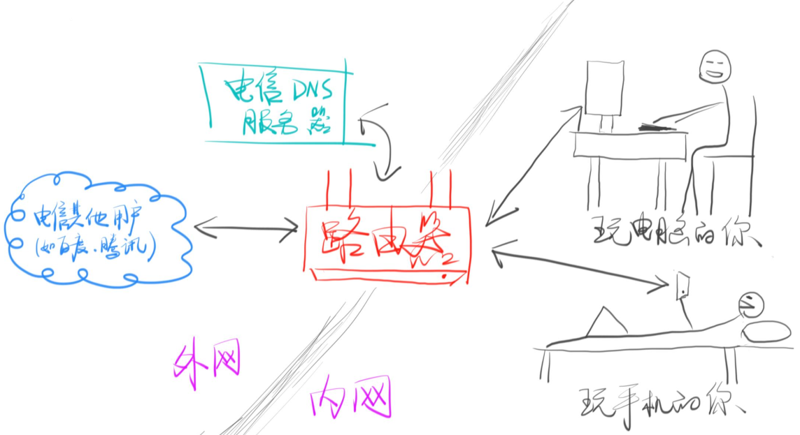
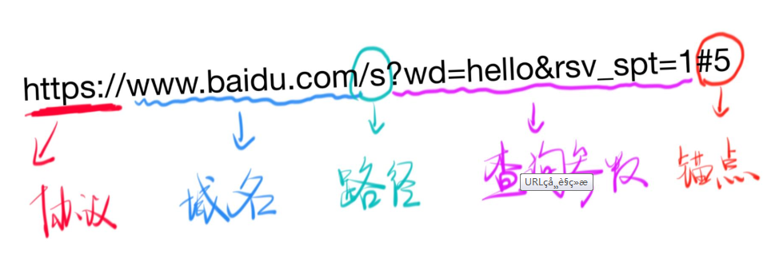

# http协议

李爵士主要发明了三样东西：www=URL+HTTP+HTML

HTTP协议——HyperText Transfer Protocol（超文本传输协议）

### IP

---

IP（internet protocal）主要约定了两件事：

1. 如何定位一台设备；
2. 如何封装数据报文，以跟其他设备交流

##### IP分为内网和外网

##### 如何知道自己的外网ip？

进入： www.ip138.com

##### 内网ip

路由器会在你家创建一个内网，内网中的设备使用内网ip，一般的格式是：192.168.xxx.xxx.

与此同时，路由器也会给内网中的每一个不同设备分配ID。如电脑是192.168.1.2，手机是192.168.1.2等，以此类推。

##### 路由器功能

内网外网就像两个隔绝的空间，无法互通，唯一的联通店就是路由器，因此，路由器也叫网关

##### 几个特殊的ip

**127.0.0.1** ：

​                     表示自己，浏览器可以通过此ip找到自己电脑上的文件（进入设备）

**localhost**：

​                      通过hosts文件（C:\Windows\System32\drivers\etc）指定为自己，找到自己电脑上的文件（进入设备，方式同前），这个文件可以让任何字符串变成对应的ip进入自己的设备

**0.0.0.0 不表示任何设备**

### 端口 port

---

​    除了ip，我们还需要端口。一台机器可以提供很多种服务，如http（80端口）、https（443端口）、ftp（21端口）等，不同的服务需要端口来支持。具体看维基百科：[0到1023号端口](https://zh.wikipedia.org/wiki/TCP/UDP%E7%AB%AF%E5%8F%A3%E5%88%97%E8%A1%A8#0.E5.88.B01023.E5.8F.B7.E7.AB.AF.E5.8F.A3)。

##### **端口使用规则**

-    0到1023号端口是留给系统用的
-   你只有拥有了管理员权限后，才能使用这1024个端口
-   其他端口可以给普通用户使用：http-server默认使用8080端口
-  一个端口如果被占用。就只能换一个端口

-  `hs . -c-1-p 端口号` 可以进入某个端口（在网页里输入：localhost端口号/文件名 ，即可进入某个本地文件）

### 小结：IP和端口缺一不可

### 域名

---

**域名就是对ip的别称**

- **baidu.com 对应什么ip**

  ping baidu.com

- **qq.com 对应什么ip**

  ping qq.com

##### 知识点

  ​               一个域名可以对应不同ip（均衡负载，防止一台机器扛不住）

  ​               一个ip可以对应不同域名（一个ip对应一个主机，此行为共享主机，没钱就这么干）

##### 域名与IP

域名与IP通过**DNS**（Domain Name System）对应起来！

**例子**：

​          **当你输入huawei.com的时候**

- ​          你的chrome浏览器会想电信/联通提供的DNS服务器询问                 huawei.com对应什么IP
- ​          电信/联通会回答一个IP（具体过程很复杂）
- ​          然后Chrome才会向对应IP的80/443端口发送请求
- ​          请求内容是：查看huawei.com的首页

问题：为什么是80或443端口？

​            服务器默认用80提供HTTP服务

​            服务器默认用443提供https服务

​            你可以在开发者工具里看到具体的端口（开发者工具 =》 Network =》 Headers =》General =》 remote address 的最后两到三位数）

##### www与域名的关系

**www**

www.huawei.com与huawei.com并不是同一个域名

**关系**

com是顶级域名

xiedaimala.com是二级域名（俗称一级域名）

www.xiedaimala.com是三级域名（俗称二级域名）

他们是父子关系

例：

​        github.io把子域名xxx.github.io免费给你使用

由此可见，俗称的一级域名和二级域名有可能不是同一家公司的，www也略显多余

### 路径

路径可以做到请求不同的页面（前面的xxx.com只能进入首页）

https://developer.mozilla.org/zh-CN/docs/Web/HTML

 上面的网页.org后面的即是路径

  ​    

### 参数     

参数作用在于：同一个页面不同内容

  www.baidu.com/s?wd=hi

如以上网址，？wd=hi意思是查询hi这个参数

### 锚点

同一个内容，不同位置

锚点看起来有中文，实际不支持中文

锚点无法在network查看，也不会传给服务器

## 一个完整的URL

协议+域名或IP+端口号+路径+查询字符串+锚点

例子：

### curl命令

---

**用curl可以发出http请求：**

​                                      curl -v http://baidu.com

​                                      curl -s -v -- https://www.baidu.com

​      用cmder发出上述请求后，可以看到，">"即是我们发送出的东西

​      

**HTTP:规定请求的格式，响应的格式**

